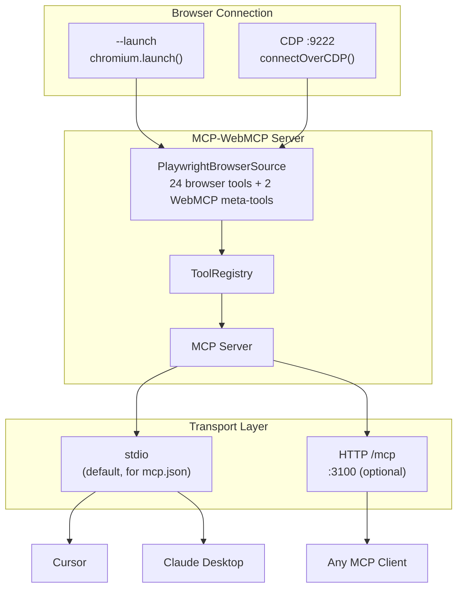
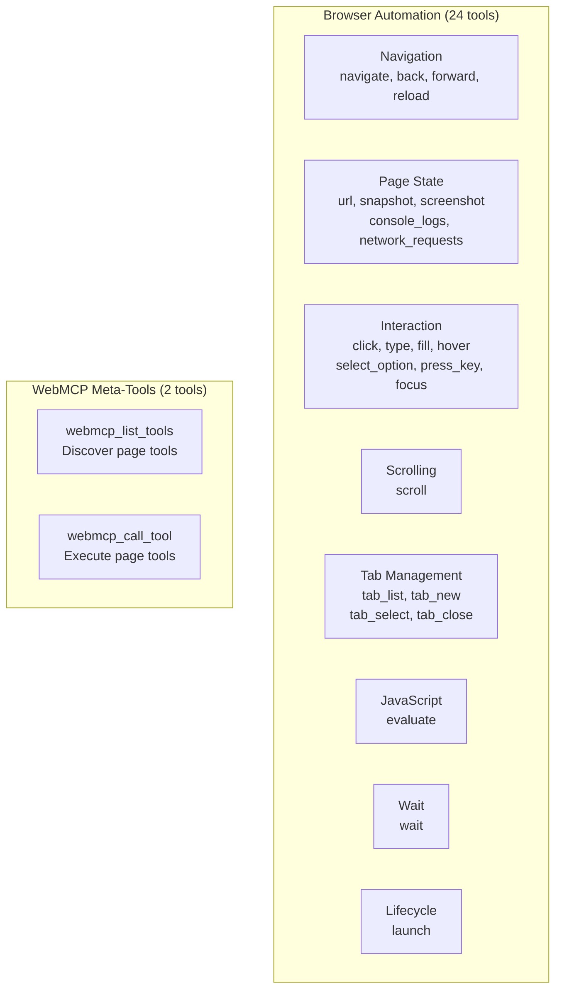
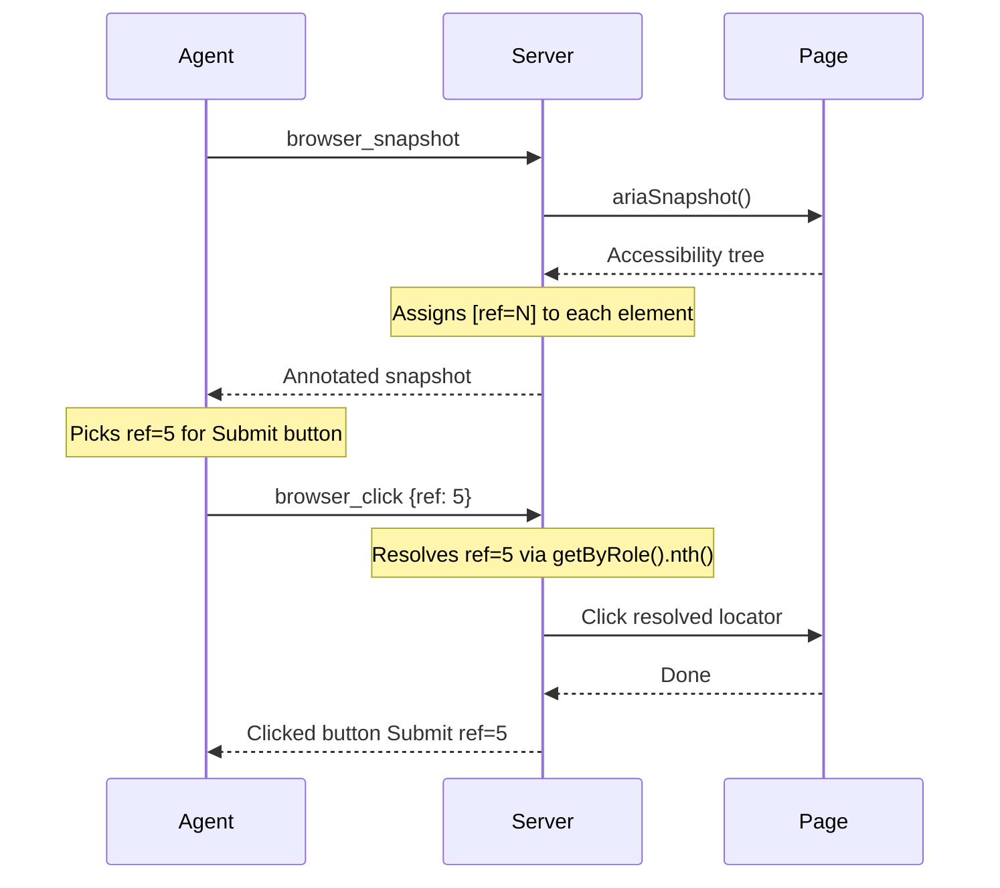
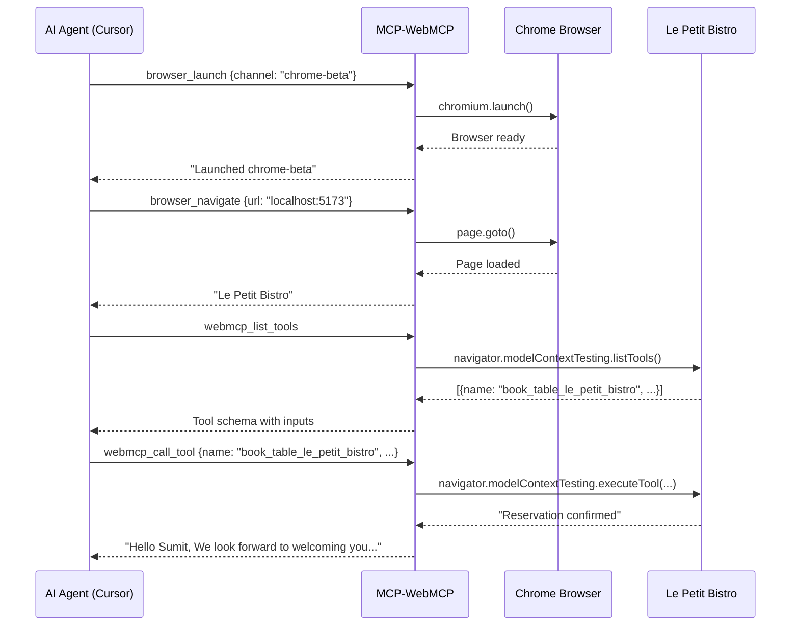
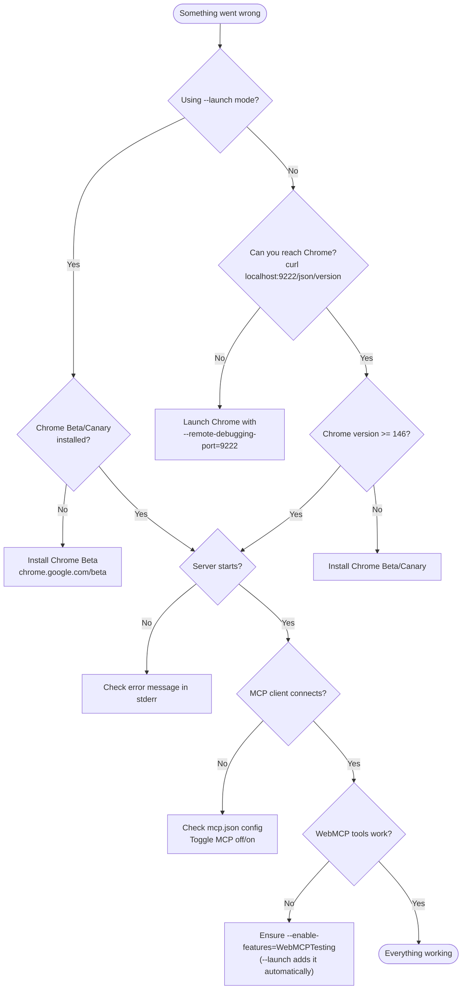

# @tech-sumit/mcp-webmcp

MCP server that gives AI agents full browser automation and [WebMCP](https://AIdevelopment.blog/web-mcp) tool access. Connects to Chrome via Playwright and exposes 26 tools over the Model Context Protocol.

## Quick Start

Add to your MCP client config (`~/.cursor/mcp.json` or Claude Desktop):

```json
{
  "mcpServers": {
    "mcp-webmcp": {
      "command": "npx",
      "args": ["-y", "@tech-sumit/mcp-webmcp", "--launch"]
    }
  }
}
```

That's it. The server launches Chrome Beta with WebMCP enabled, connects via stdio, and exposes 26 browser tools to your AI agent. No manual Chrome launch needed.

## Architecture



### Connection Modes

| Mode | Flag | How it works | When to use |
|---|---|---|---|
| **Launch** | `--launch` | Launches a new Chrome window via `chromium.launch()`. Playwright handles OS-specific path resolution (Mac/Linux/Windows). Injects `--enable-features=WebMCPTesting` automatically. | Zero-config setup from mcp.json. No pre-running Chrome needed. |
| **CDP** | _(default)_ | Connects to an existing Chrome via `chromium.connectOverCDP()`. Requires Chrome running with `--remote-debugging-port=9222`. | When you want to use your existing Chrome with tabs/sessions. |

### Transport Modes

| Transport | How to use | When to use |
|---|---|---|
| **stdio** | Run `mcp-webmcp` (no subcommand) | For mcp.json / npx. Client spawns process, communicates via stdin/stdout. |
| **HTTP** | Run `mcp-webmcp start` | For hosted/manual usage. Streamable HTTP on `/mcp` endpoint. |

## Prerequisites

| Requirement | Details |
|---|---|
| **Node.js** | v18+ |
| **Chrome** | Version **146+** (Beta or Canary). Stable Chrome will not work until WebMCP ships. |

### Checking your Chrome version

```bash
# macOS — Chrome Beta
/Applications/Google\ Chrome\ Beta.app/Contents/MacOS/Google\ Chrome\ Beta --version

# macOS — Chrome Canary
/Applications/Google\ Chrome\ Canary.app/Contents/MacOS/Google\ Chrome\ Canary --version

# Linux
google-chrome-beta --version

# Windows
"C:\Program Files\Google\Chrome Beta\Application\chrome.exe" --version
```

The server validates Chrome >= 146 on startup and will throw a clear error if the version is too old.

## Setup

### Option A: Launch mode (recommended)

The server launches its own Chrome instance. No manual Chrome setup needed.

#### Cursor

Add to `~/.cursor/mcp.json`:

```json
{
  "mcpServers": {
    "mcp-webmcp": {
      "command": "npx",
      "args": ["-y", "@tech-sumit/mcp-webmcp", "--launch"]
    }
  }
}
```

Or for local development:

```json
{
  "mcpServers": {
    "mcp-webmcp": {
      "command": "node",
      "args": ["/path/to/dist/cli.js", "--launch"]
    }
  }
}
```

#### Claude Desktop

Add to `~/Library/Application Support/Claude/claude_desktop_config.json`:

```json
{
  "mcpServers": {
    "mcp-webmcp": {
      "command": "npx",
      "args": ["-y", "@tech-sumit/mcp-webmcp", "--launch"]
    }
  }
}
```

#### Launch options

| Flag | Description | Default |
|---|---|---|
| `--launch` | Enable launch mode | _(off, uses CDP)_ |
| `--channel <ch>` | Browser channel: `chrome`, `chrome-beta`, `chrome-canary`, `msedge`, `msedge-beta`, `msedge-dev` | `chrome-beta` |
| `--headless` | Run browser in headless mode | `false` |
| `--url <url>` | Navigate to URL after launch | _(none)_ |

### Option B: CDP mode (connect to existing Chrome)

Attach to an existing Chrome instance with remote debugging enabled.

#### 1. Launch Chrome with flags

```bash
# macOS — Chrome Beta
/Applications/Google\ Chrome\ Beta.app/Contents/MacOS/Google\ Chrome\ Beta \
  --remote-debugging-port=9222 \
  --enable-features=WebMCPTesting

# Linux
google-chrome-beta \
  --remote-debugging-port=9222 \
  --enable-features=WebMCPTesting

# Windows
"C:\Program Files\Google\Chrome Beta\Application\chrome.exe" ^
  --remote-debugging-port=9222 ^
  --enable-features=WebMCPTesting
```

> **Tip:** Close all existing Chrome windows before running this command, or Chrome will connect to the existing instance which may not have the flags enabled.

#### 2. Configure MCP client

```json
{
  "mcpServers": {
    "mcp-webmcp": {
      "command": "npx",
      "args": ["-y", "@tech-sumit/mcp-webmcp"]
    }
  }
}
```

#### CDP options

| Flag | Description | Default |
|---|---|---|
| `--cdp-host <host>` | Chrome debugging host | `localhost` |
| `--cdp-port <port>` | Chrome debugging port | `9222` |

### Option C: HTTP transport (hosted server)

For manual or hosted usage, run the server as an HTTP endpoint:

```bash
mcp-webmcp start [--launch] [--port 3100]
```

Connect your MCP client to `http://localhost:3100/mcp`.

### Auto-configure

```bash
mcp-webmcp config cursor   # writes ~/.cursor/mcp.json
mcp-webmcp config claude    # writes Claude Desktop config
```

## Available Tools (26)

### Tool Categories



### Browser Automation (24 tools)

| Tool | Description |
|---|---|
| `browser_launch` | Launch a new browser window (closes existing). Supported channels: chrome, chrome-beta, chrome-canary, msedge. Cross-platform. |
| `browser_navigate` | Navigate to a URL |
| `browser_back` | Go back in history |
| `browser_forward` | Go forward in history |
| `browser_reload` | Reload current page |
| `browser_url` | Get current URL and title |
| `browser_snapshot` | Accessibility tree with `[ref=N]` markers for element targeting |
| `browser_screenshot` | Take a PNG screenshot |
| `browser_console_logs` | Get buffered console log messages |
| `browser_network_requests` | Get buffered network requests with status codes |
| `browser_click` | Click an element by ref |
| `browser_type` | Type text character by character |
| `browser_fill` | Clear and fill an input field |
| `browser_hover` | Hover over an element |
| `browser_select_option` | Select a dropdown option |
| `browser_press_key` | Press a keyboard key |
| `browser_focus` | Focus an element |
| `browser_scroll` | Scroll page or element |
| `browser_tab_list` | List all open tabs |
| `browser_tab_new` | Open a new tab |
| `browser_tab_select` | Switch to a tab |
| `browser_tab_close` | Close a tab |
| `browser_evaluate` | Execute JavaScript in page context |
| `browser_wait` | Wait for time or CSS selector |

### WebMCP Meta-Tools (2 tools)

| Tool | Description |
|---|---|
| `webmcp_list_tools` | List WebMCP tools registered on the active page |
| `webmcp_call_tool` | Execute a WebMCP tool by name on the active page |

WebMCP tools are **dynamic** — they change as the user navigates between pages. Always call `webmcp_list_tools` before `webmcp_call_tool` to discover what's available.

### Element Targeting: Snapshot + Ref



## CLI Reference

### `mcp-webmcp` (default — stdio mode)

Run as stdio MCP server. This is what `mcp.json` invokes.

```bash
mcp-webmcp [options]
```

| Option | Description | Default |
|---|---|---|
| `--launch` | Launch a new browser instead of connecting via CDP | `false` |
| `--channel <ch>` | Browser channel for `--launch` | `chrome-beta` |
| `--headless` | Launch in headless mode | `false` |
| `--url <url>` | Initial URL to open | _(none)_ |
| `--cdp-host <host>` | CDP host (when not using `--launch`) | `localhost` |
| `--cdp-port <port>` | CDP port (when not using `--launch`) | `9222` |
| `--extension` | Enable Chrome extension WebSocket bridge | `false` |
| `--ws-port <port>` | Extension WebSocket port | `8765` |
| `--no-browser-tools` | Disable Playwright browser tools | `false` |

### `mcp-webmcp start` (HTTP mode)

Start the MCP server over HTTP.

```bash
mcp-webmcp start [options]
```

Same options as stdio mode, plus:

| Option | Description | Default |
|---|---|---|
| `--port <port>` | HTTP server port | `3100` |

### `mcp-webmcp list-tools`

List all WebMCP tools from connected browser tabs (uses CDP directly).

```bash
mcp-webmcp list-tools [--host localhost] [--port 9222]
```

### `mcp-webmcp call-tool <name> [args]`

Execute a WebMCP tool by name.

```bash
mcp-webmcp call-tool searchFlights '{"from":"SFO","to":"JFK"}'
```

### `mcp-webmcp config <client>`

Write MCP client configuration (stdio-based).

```bash
mcp-webmcp config cursor   # writes ~/.cursor/mcp.json
mcp-webmcp config claude    # writes Claude Desktop config
```

## Demo: Booking a Table via WebMCP

This demo shows the full flow: an AI agent uses `browser_launch` to open Chrome, navigates to a WebMCP-enabled restaurant page, discovers the `book_table_le_petit_bistro` tool, and books a table — all via MCP.

### Agent Workflow



### What happens

1. **`browser_launch`** opens Chrome Beta with `--enable-features=WebMCPTesting`
2. **`browser_navigate`** loads the Le Petit Bistro reservation form
3. **`webmcp_list_tools`** discovers `book_table_le_petit_bistro` and its full input schema (name, phone, date, time, guests, seating, requests)
4. **`webmcp_call_tool`** books the table — the form auto-fills and a confirmation modal appears: *"Reservation Received — Bon Appetit!"*

## Troubleshooting

### Decision Tree



### Common Issues

#### "Chrome version X is not supported"

Your Chrome is older than 146. Install Chrome Beta or Canary:
- https://www.google.com/chrome/beta/
- https://www.google.com/chrome/canary/

#### "WebMCP is NOT available"

Chrome was not launched with `--enable-features=WebMCPTesting`. If using CDP mode, close all Chrome windows and relaunch with the flag. Launch mode (`--launch`) adds this flag automatically.

#### "No browser contexts found"

Chrome is not running with `--remote-debugging-port=9222`, or it has no tabs open. Use `--launch` mode instead, or verify with:

```bash
curl http://localhost:9222/json/version
```

#### "Target page, context or browser has been closed"

The browser connection was lost. Use `browser_launch` tool to start a new browser, or restart the MCP server.

#### Screenshot timeouts

Playwright waits for web fonts to load before taking screenshots. The server uses a 10-second timeout to avoid hanging.

#### Click fails on modal/overlay elements

Elements in `position: fixed` overlays may not be scrollable into view. The server automatically retries with `force: true` to click at the element's coordinates directly.

## Development

```bash
pnpm install           # install dependencies
pnpm build             # compile with tsup → dist/
pnpm dev               # watch mode
pnpm start             # run HTTP server (CDP mode)
pnpm start:stdio       # run stdio server
pnpm typecheck         # tsc --noEmit
pnpm lint              # eslint
pnpm test              # vitest
pnpm format            # prettier
```

## License

MIT
