# @tech-sumit/ai-inspector-server

MCP server that gives AI agents full browser automation and [WebMCP](https://AIdevelopment.blog/web-mcp) tool access. Connects to a running Chrome instance via Playwright and exposes 25 tools over the Model Context Protocol.

## Architecture

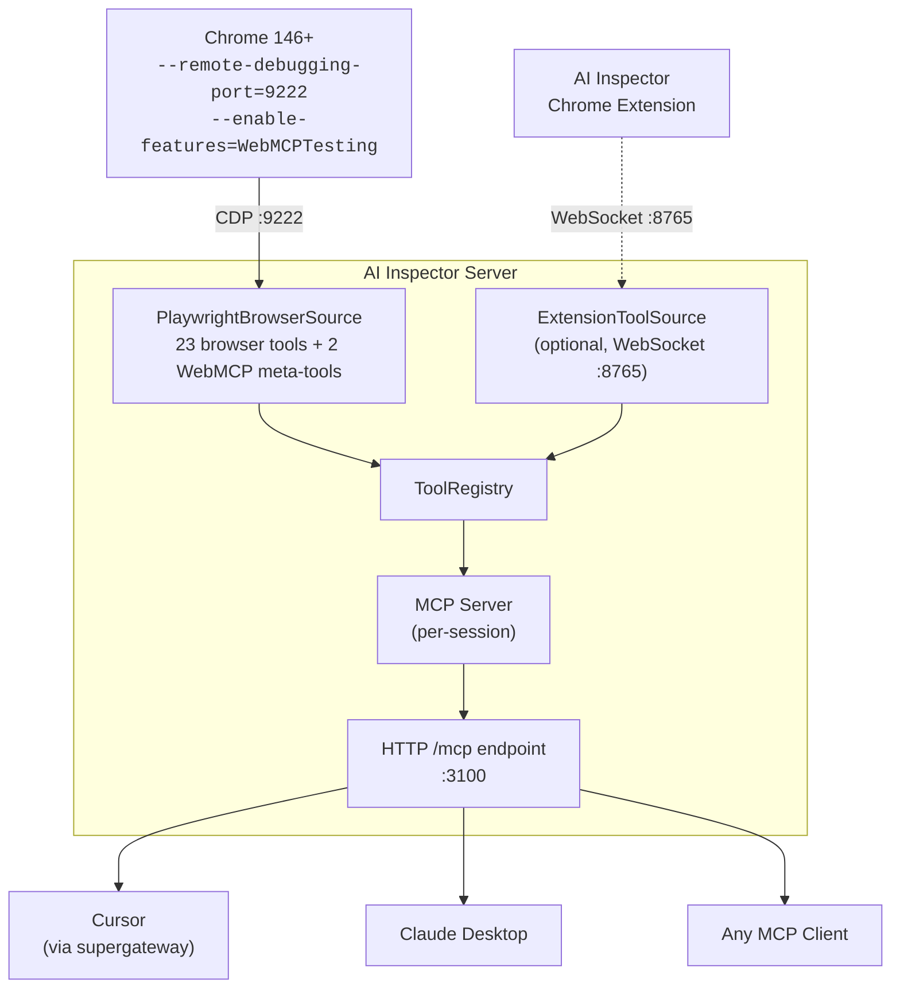

### Tool Flow

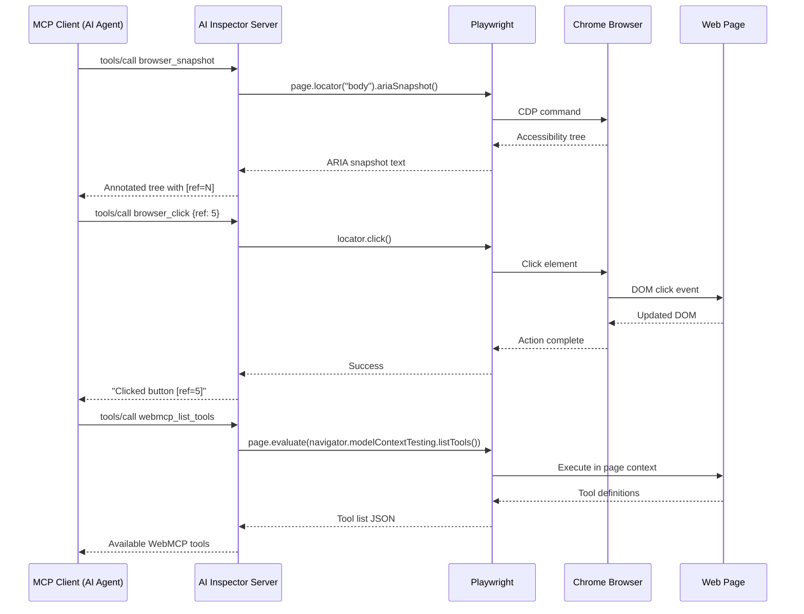

## Prerequisites

| Requirement | Details |
|---|---|
| **Node.js** | v18+ |
| **Chrome** | Version **146+** (Beta or Canary). Stable Chrome will not work until WebMCP ships. |
| **Playwright browsers** | Installed via `npx playwright install chromium` (only needed once) |

### Checking your Chrome version

```bash
# macOS — Chrome Beta
/Applications/Google\ Chrome\ Beta.app/Contents/MacOS/Google\ Chrome\ Beta --version

# macOS — Chrome Canary
/Applications/Google\ Chrome\ Canary.app/Contents/MacOS/Google\ Chrome\ Canary --version

# Linux
google-chrome-beta --version
```

The server validates Chrome >= 146 on startup and will throw a clear error if the version is too old.

## Setup

### Setup Overview

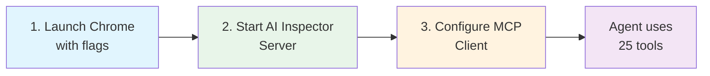

### 1. Launch Chrome with remote debugging and WebMCP

Chrome must be started with two flags:

- `--remote-debugging-port=9222` — allows Playwright to connect
- `--enable-features=WebMCPTesting` — enables `navigator.modelContextTesting` for WebMCP tools

```bash
# macOS — Chrome Beta
/Applications/Google\ Chrome\ Beta.app/Contents/MacOS/Google\ Chrome\ Beta \
  --remote-debugging-port=9222 \
  --enable-features=WebMCPTesting

# macOS — Chrome Canary
/Applications/Google\ Chrome\ Canary.app/Contents/MacOS/Google\ Chrome\ Canary \
  --remote-debugging-port=9222 \
  --enable-features=WebMCPTesting

# Linux
google-chrome-beta \
  --remote-debugging-port=9222 \
  --enable-features=WebMCPTesting

# Windows
"C:\Program Files\Google\Chrome Beta\Application\chrome.exe" ^
  --remote-debugging-port=9222 ^
  --enable-features=WebMCPTesting
```

> **Tip:** Close all existing Chrome windows before running this command, or Chrome will connect to the existing instance which may not have the flags enabled.

Verify Chrome is listening:

```bash
curl http://localhost:9222/json/version
```

You should see a JSON response with `"Browser": "Chrome/146.x.x.x"`.

### 2. Install and start the server

```bash
# From the monorepo
cd projects/webmcp/ai-inspector-server
pnpm install
pnpm build
pnpm start

# Or run directly
node dist/cli.js start
```

On successful startup you'll see:

```
[AI Inspector] Chrome version: 146.0.7680.0 (>= 146 required)
[AI Inspector] WebMCP (navigator.modelContextTesting) is available
[AI Inspector] Browser tools enabled: 25 tools via Playwright
[AI Inspector] HTTP server listening on http://localhost:3100
[AI Inspector] MCP endpoint: http://localhost:3100/mcp
```

#### Startup Checks

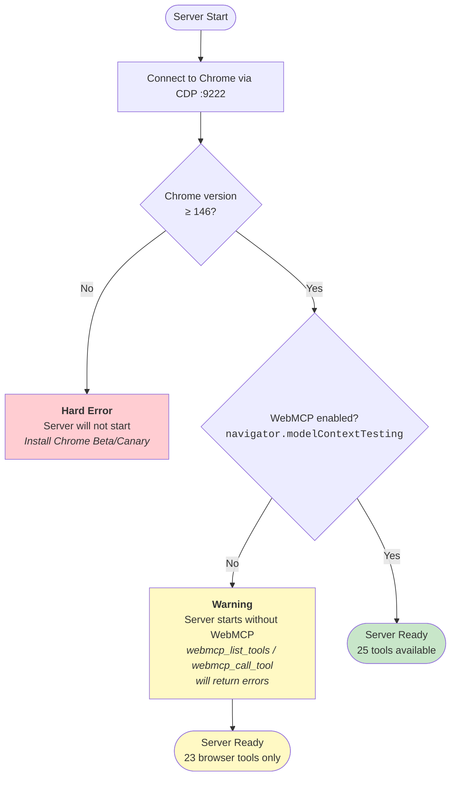

### 3. Connect your MCP client

#### Client Connection Options

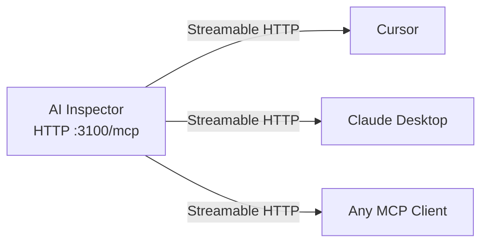

All clients connect via **Streamable HTTP** — no bridges or adapters needed.

#### Cursor

```bash
ai-inspector config cursor
```

Or manually add to `~/.cursor/mcp.json`:

```json
{
  "mcpServers": {
    "ai-inspector": {
      "url": "http://localhost:3100/mcp"
    }
  }
}
```

Then restart Cursor or toggle the MCP server off/on in Cursor Settings > MCP.

#### Claude Desktop

```bash
ai-inspector config claude
```

Or manually add to `~/Library/Application Support/Claude/claude_desktop_config.json`:

```json
{
  "mcpServers": {
    "ai-inspector": {
      "url": "http://localhost:3100/mcp"
    }
  }
}
```

#### Any MCP client

Point your client to:

```
http://localhost:3100/mcp
```

The server supports the MCP Streamable HTTP transport with per-session state.

## Available Tools (25)

### Tool Categories

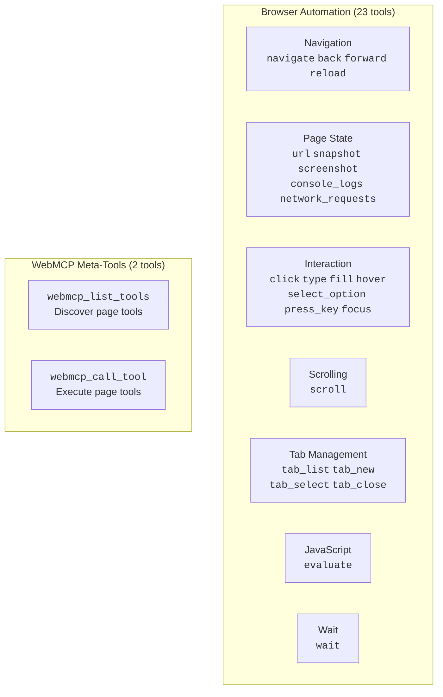

### Browser Automation (23 tools)

| Tool | Description |
|---|---|
| `browser_navigate` | Navigate to a URL |
| `browser_back` | Go back in history |
| `browser_forward` | Go forward in history |
| `browser_reload` | Reload current page |
| `browser_url` | Get current URL and title |
| `browser_snapshot` | Accessibility tree with `[ref=N]` markers for element targeting |
| `browser_screenshot` | Take a PNG screenshot |
| `browser_console_logs` | Get buffered console log messages |
| `browser_network_requests` | Get buffered network requests with status codes |
| `browser_click` | Click an element by ref |
| `browser_type` | Type text character by character |
| `browser_fill` | Clear and fill an input field |
| `browser_hover` | Hover over an element |
| `browser_select_option` | Select a dropdown option |
| `browser_press_key` | Press a keyboard key |
| `browser_focus` | Focus an element |
| `browser_scroll` | Scroll page or element |
| `browser_tab_list` | List all open tabs |
| `browser_tab_new` | Open a new tab |
| `browser_tab_select` | Switch to a tab |
| `browser_tab_close` | Close a tab |
| `browser_evaluate` | Execute JavaScript in page context |
| `browser_wait` | Wait for time or CSS selector |

### WebMCP Meta-Tools (2 tools)

| Tool | Description |
|---|---|
| `webmcp_list_tools` | List WebMCP tools registered on the active page |
| `webmcp_call_tool` | Execute a WebMCP tool by name on the active page |

WebMCP tools are **dynamic** — they change as the user navigates between pages. Always call `webmcp_list_tools` before `webmcp_call_tool` to discover what's available.

### Element Targeting: Snapshot + Ref

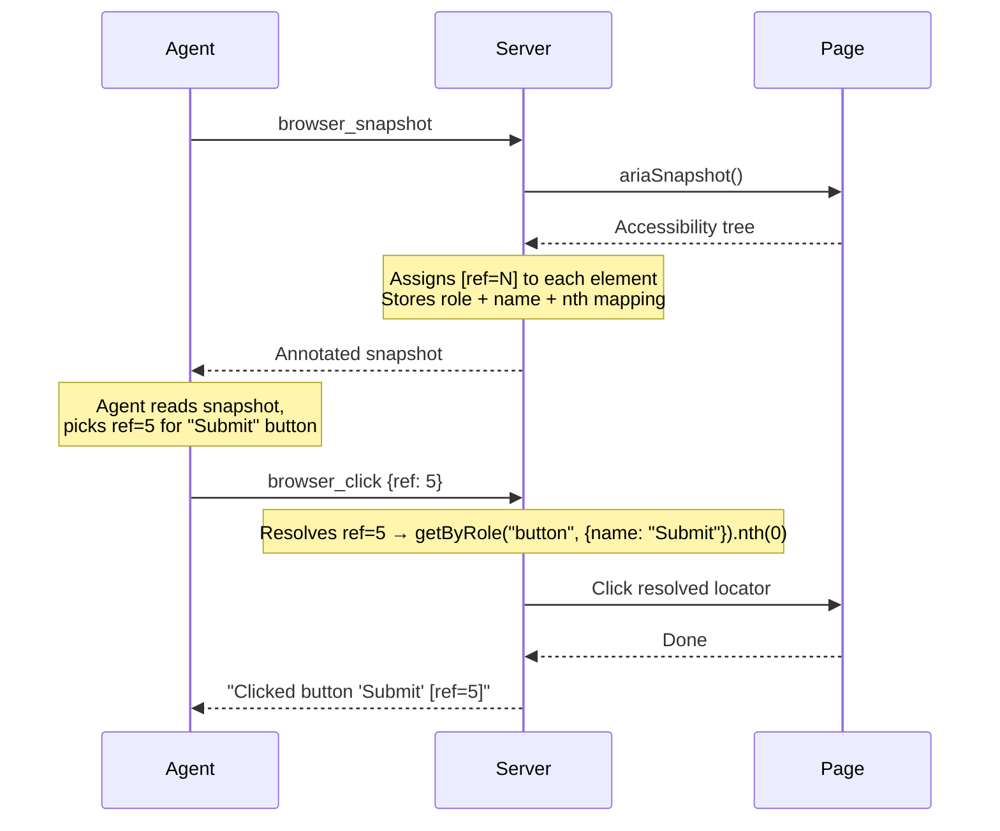

## CLI Reference

### `ai-inspector start`

Start the MCP server.

```bash
ai-inspector start [options]
```

| Option | Description | Default |
|---|---|---|
| `--cdp-host <host>` | Chrome debugging host | `localhost` |
| `--cdp-port <port>` | Chrome debugging port | `9222` |
| `--port <port>` | HTTP server port | `3100` |
| `--extension` | Enable Chrome extension WebSocket bridge | `false` |
| `--ws-port <port>` | Extension WebSocket port | `8765` |
| `--no-browser-tools` | Disable Playwright browser automation | `false` |

### `ai-inspector list-tools`

List all WebMCP tools from connected browser tabs (uses CDP directly).

```bash
ai-inspector list-tools [--host localhost] [--port 9222]
```

### `ai-inspector call-tool <name> [args]`

Execute a WebMCP tool by name.

```bash
ai-inspector call-tool searchFlights '{"from":"SFO","to":"JFK"}'
```

### `ai-inspector config <client>`

Write MCP client configuration.

```bash
ai-inspector config cursor   # writes ~/.cursor/mcp.json
ai-inspector config claude    # writes Claude Desktop config
```

## Example: End-to-End Demo

### Setup Terminals

```mermaid
gantt
    title Terminal Setup
    dateFormat X
    axisFormat %s

    section Terminal 1
    Launch Chrome with flags       :a1, 0, 5

    section Terminal 2
    Start WebMCP demo app (port 4200) :a2, 2, 7

    section Terminal 3
    Start AI Inspector server      :a3, 4, 9

    section Terminal 4
    Open demo in Chrome tab        :a4, 6, 8
```

```bash
# Terminal 1 — Launch Chrome
/Applications/Google\ Chrome\ Beta.app/Contents/MacOS/Google\ Chrome\ Beta \
  --remote-debugging-port=9222 \
  --enable-features=WebMCPTesting

# Terminal 2 — Start a WebMCP demo app
cd projects/webmcp/library/demos/french-bistro
pnpm dev --port 4200

# Terminal 3 — Start the AI Inspector server
cd projects/webmcp/ai-inspector-server
pnpm start

# Terminal 4 — Navigate Chrome to the demo
curl -X PUT "http://localhost:9222/json/new?http://localhost:4200"
```

### Agent Workflow

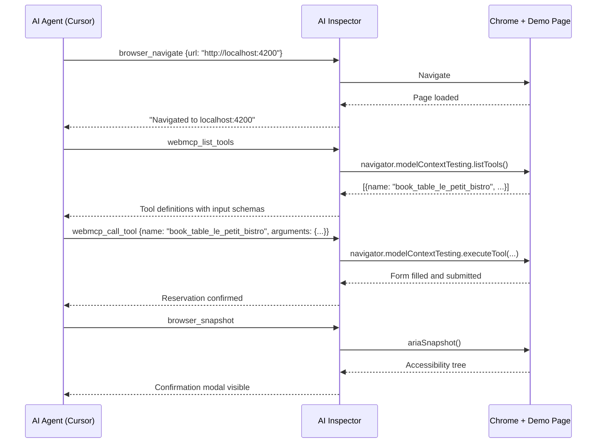

## Session Management

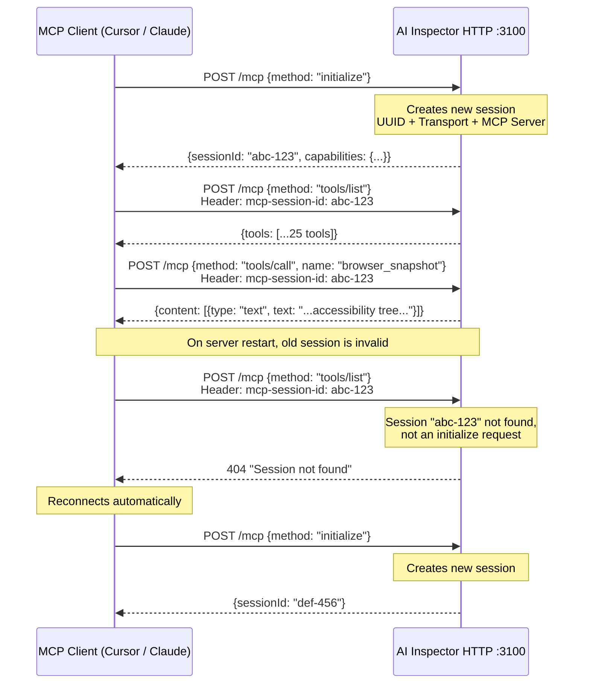

## Troubleshooting

### Decision Tree

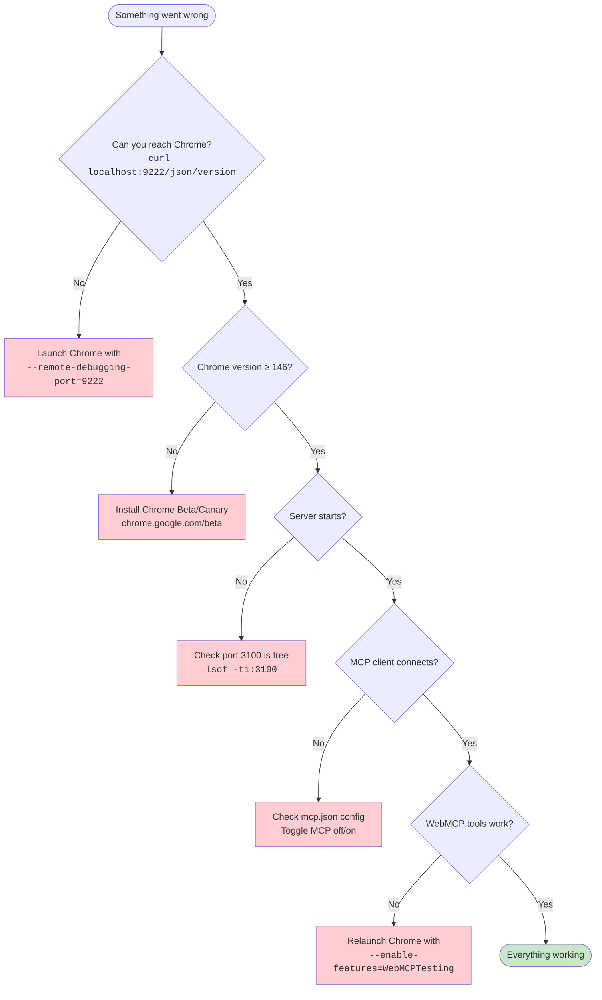

### Common Issues

#### "Chrome version X is not supported"

Your Chrome is older than 146. Install Chrome Beta or Canary:
- https://www.google.com/chrome/beta/
- https://www.google.com/chrome/canary/

#### "WebMCP is NOT available"

Chrome was not launched with `--enable-features=WebMCPTesting`. Close all Chrome windows and relaunch with the flag.

#### "No browser contexts found"

Chrome is not running with `--remote-debugging-port=9222`, or it has no tabs open. Verify with:

```bash
curl http://localhost:9222/json/version
```

#### "Server not initialized" errors in MCP client

This happens when the MCP client tries to reuse a stale session after the server restarts. Toggle the MCP server off and on in your client settings, or restart the client.

#### Screenshot timeouts

Playwright waits for web fonts to load before taking screenshots. The server uses a 10-second timeout to avoid hanging. If screenshots still time out on slow connections, the page will be captured as-is after the timeout.

#### Click fails on modal/overlay elements

Elements in `position: fixed` overlays may not be scrollable into view. The server automatically retries with `force: true` to click at the element's coordinates directly.

## Development

```bash
pnpm install           # install dependencies
pnpm build             # compile with tsup → dist/
pnpm dev               # watch mode
pnpm start             # run the server
pnpm typecheck         # tsc --noEmit
pnpm lint              # eslint
pnpm test              # vitest
pnpm format            # prettier
```

## License

MIT
